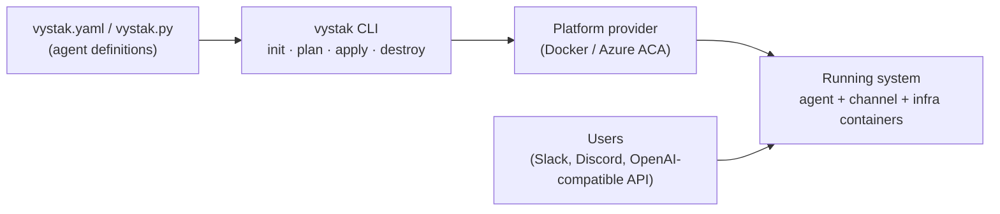
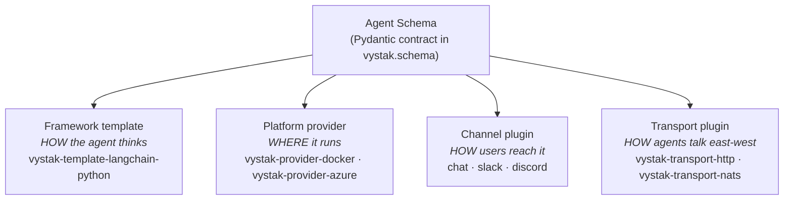
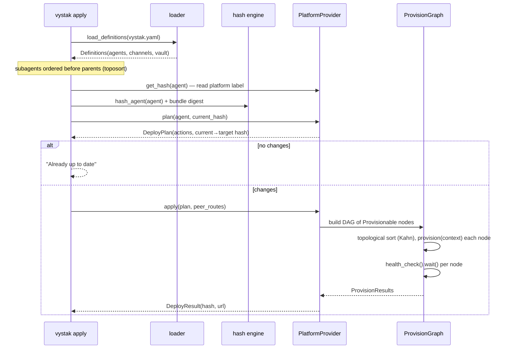
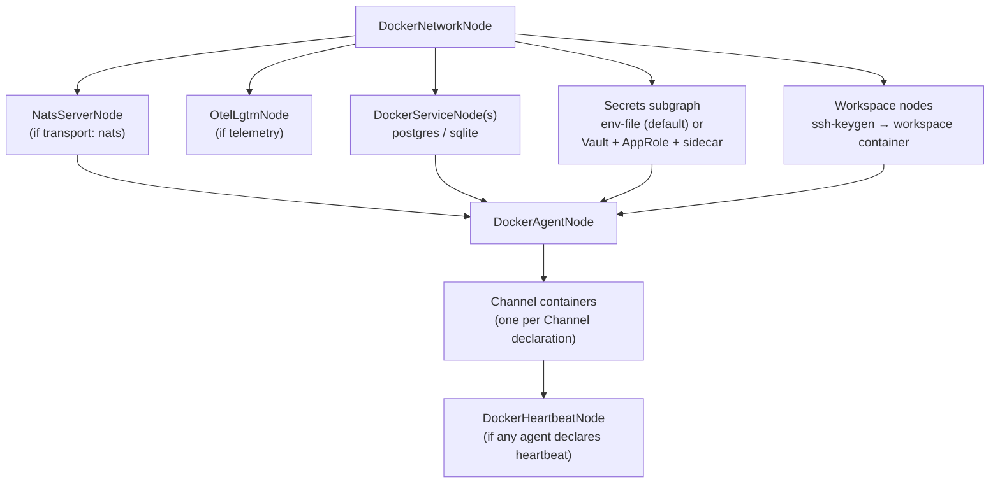
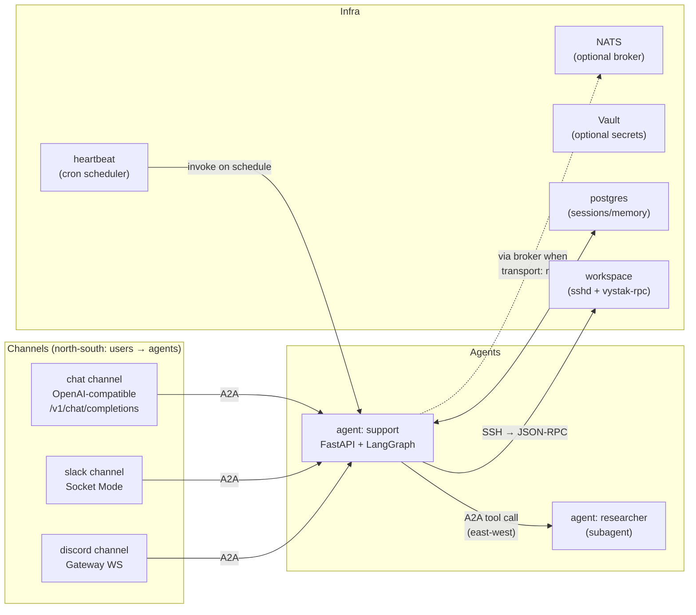

# Vystak Architecture

How Vystak actually works: the packages, the deploy lifecycle, and the runtime
topology. For the philosophy behind these choices, read [Principles](principles.md);
for dev-environment setup, read [Getting Started](getting-started.md).

## The big picture

Vystak is a declarative deployment tool for AI agents. You describe agents in a
definition file (`vystak.yaml` or `vystak.py`), and the CLI provisions everything
they need — containers, channels, brokers, secrets, schedulers — on the platform
you choose. Vystak itself holds no state: the definition is the desired state,
the platform is the actual state, and content hashes stored as platform labels
are the diff mechanism.



## Orthogonal axes

The core design idea: an agent definition is compiled against four independent
choices, and none of them abstracts the others. Any combination works; switching
one axis never requires rewriting the definition.



Each axis is a plugin behind an ABC defined in
`packages/python/vystak/src/vystak/providers/base.py`:

| ABC | Key methods | Implementations |
|---|---|---|
| `PlatformProvider` | `plan` / `apply` / `destroy` / `status` / `get_hash`, plus `*_channel` variants | `vystak-provider-docker`, `vystak-provider-azure` |
| `ChannelPlugin` | `build_bundle`, `provision_nodes`, `thread_name`, `health_check` | `vystak-channel-chat` / `-slack` / `-discord` |
| `TransportPlugin` | `build_provision_nodes`, `generate_env_contract` | `vystak-transport-http`, `vystak-transport-nats` |

Channel plugins register themselves through the `vystak.channels` entry point
into `ChannelPluginRegistry` (importing a channel package is what registers it —
the CLI imports all three as a side effect).

**No source codegen anywhere.** Components are real, importable Python modules.
The only things emitted as strings are build artifacts — Dockerfiles,
requirements files, Vault HCL, config JSON. `FileBundle` (the deprecated alias
`GeneratedCode` still exists) is a file-transport container for real files, not
generated source.

## Package map

All implementation is Python (`packages/python/`); the TypeScript workspace
contains placeholder stubs only.

| Layer | Package | Role |
|---|---|---|
| Core | `vystak` | Schema models, hash engine, provisioning graph, plugin ABCs, transport client, MCP normalization, stores |
| CLI | `vystak-cli` | `vystak init \| plan \| apply \| destroy \| status \| logs \| secrets \| update` |
| REPL | `vystak-chat` | Terminal client to talk to deployed agents (A2A + agent picker) |
| Framework | `vystak-template-langchain-python` | The LangChain/LangGraph agent project template (bundled into the CLI wheel) |
| Providers | `vystak-provider-docker`, `vystak-provider-azure` | Deploy to local Docker / Azure Container Apps |
| Channels | `vystak-channel-runtime`, `-chat`, `-slack`, `-discord` | Shared channel base + one deployable container per channel type |
| Transports | `vystak-transport-http`, `vystak-transport-nats` | East-west A2A over direct HTTP or NATS JetStream |
| Infra | `vystak-heartbeat` | Standalone cron scheduler container |
| Infra | `vystak-workspace-rpc` | JSON-RPC 2.0 server spoken over SSH inside workspace containers |

## The schema contract

`vystak.schema.Agent` is the authoritative shape — everything generates *from*
it: template runtime configuration, provisioning, hashing, validation.

Key models (all Pydantic, under `vystak/src/vystak/schema/`):

- **`Agent`** — `framework`, `instructions`, `default_model` + `models` pool,
  `skills` (inline tool bundles or `skills/<name>/SKILL.md` folder skills,
  resolved at load time by `schema/skill_resolver.py`), `mcp_servers`,
  `workspace`, `secrets`, `platform`, `sessions`, `memory`, `services`,
  `subagents` (nested `Agent`s), `compaction`, `heartbeat`.
- **`Channel`** — `type` (chat/slack/discord), `platform`, `config`, `secrets`,
  `agents` (which agents are routable through it), policies and thread config.
- **`Platform`** — `type` + `provider` + optional `transport` (defaults to HTTP)
  and `telemetry`.
- **`Transport`** — `http` | `nats` | `azure-service-bus`, with per-type config
  and optional BYO connection.
- **`Vault`** / **`Secret`** — opt-in secret backend; a bare `Secret` name means
  "resolve from `.env`".
- **`Workspace`** — a separate execution-environment container (image,
  persistence, network, GPU, SSH identity).
- **`Heartbeat`** / **`Compaction`** — cron-scheduled invocation config and
  context-compaction policy.

Loading paths, in order of what users actually touch:

1. `vystak_cli.loader.load_definitions` — finds `vystak.yaml` / `vystak.yml` /
   `vystak.py` by convention. Python files are exec'd and all module-level
   `Agent`/`Channel` instances are collected; `vystak.<env>.py` provides
   per-environment overlays.
2. `vystak.schema.multi_loader.load_multi_yaml` — multi-document YAML with named
   top-level `providers`, `platforms`, `models`, `agents`, `channels`, `vault`;
   resolves named references and validates channel↔agent and heartbeat
   `target_channel` links.
3. `vystak.schema.loader.load_agent` — single-agent YAML/JSON (rejects
   `subagents`; multi-doc layout required for that).

## Deploy lifecycle

### `vystak init` — scaffold, don't generate

`init` copies the framework template wholesale into the user's project. The
result is a real, runnable project tree:

```
my-agent/
├── vystak.yaml          # the definition          (user-owned)
├── server.py            # entrypoint              (user-owned)
├── Dockerfile           # build recipe            (user-owned)
├── tools/               # user tool functions     (user-owned)
└── _vystak/             # framework runtime       (refreshed by `vystak update`)
    └── runtime/         # app_factory, graph, mcp, memory, subagents,
                         # compaction/, a2a_native/, openai/
```

The user owns the top level; `_vystak/runtime/` is the framework machinery and
is replaced on `vystak update`. There is no generated source to regenerate —
`server.py` just calls `app_factory.build_agent_app(agent)`.

### `vystak plan` / `apply` — hash-based change detection

There are no state files. `vystak.hash.AgentHashTree` computes a per-section
content hash of the definition (brain, skills, MCP servers, workspace, secrets,
sessions, memory, transport, subagents, compaction, heartbeat, template, …) and
a `root` hash over all sections. The provider stores the root hash as a platform
label (a Docker container label, an ACA app tag). `plan` compares the freshly
computed hash against the stored one — that diff, computed from scratch on any
machine, is the entire change-detection mechanism.



### The provisioning graph

Providers don't script deployments imperatively — they build a
`ProvisionGraph` (`vystak.provisioning`): a DAG of `Provisionable` nodes, each
with a `name`, `depends_on`, `provision(context)`, `health_check()`, and
`destroy()`. The graph topologically sorts, executes nodes in order, threads
accumulated results through `context`, and waits on each node's health check
(TCP, HTTP, container-exec, or no-op). `destroy_all()` tears down in reverse
order. A typical Docker apply builds:



Azure follows the same pattern with its own node chain:
`ResourceGroupNode → LogAnalyticsNode → ACRNode → ACAEnvironmentNode →
(AzurePostgresNode) → ACAAppNode`, plus Key Vault + managed-identity nodes for
secrets and Azure Files for workspace persistence.

## Runtime topology

After `vystak apply`, the running system is a set of cooperating containers:



### Inside an agent container

Every agent built from the LangChain template serves, on its HTTP port (wired
by `_vystak/runtime/app_factory.py`):

| Endpoint | What |
|---|---|
| `GET /.well-known/agent.json` | A2A Agent Card |
| `POST /a2a` | A2A JSON-RPC (a2a-sdk, `LangGraphExecutor`) |
| `POST /v1/chat/completions`, `/v1/responses`, `GET /v1/models` | OpenAI-compatible surface |
| `GET /healthz` | Health check |

The runtime composes: a LangGraph react-agent (`graph.py`), user tools from
`tools/`, MCP tools (`mcp.py`, normalized by `vystak.mcp` with transport
inference and `${secret.X}` interpolation), memory/session stores, compaction,
and — when the agent declares `subagents` — one A2A tool per subagent.

### East-west: agents calling agents

Subagent calls go through the `vystak.transport` abstraction, not hard-coded
URLs. At apply time the CLI builds a `peer_routes` JSON map
(`{short_name: {canonical, address, card_url}}`) via the transport plugin and
injects it into the parent container. At runtime, `subagents.py` turns each
route into a tool: fetch the peer's agent card, then `send_task`/`stream_task`.

- **HTTP transport** — no broker; `address` is the peer's container URL and
  calls POST to its `/a2a` endpoint.
- **NATS transport** — the provider provisions a NATS server; `address` is a
  subject, and an in-container NATS↔HTTP bridge
  (`_vystak/runtime/nats_bridge.py`) subscribes on the agent's subject and
  forwards to the local HTTP app.

Channel containers use the same client machinery (`A2AAgentClient` /
`NatsAgentClient` from `vystak-channel-runtime`) against their
`resolved_routes`.

### North-south: channels

Each `Channel` declaration deploys as its **own container**, built on
`vystak-channel-runtime` (agent client, delivery pipeline, heartbeat hooks,
state store, telemetry):

- **chat** — OpenAI-compatible unified endpoint; routes by
  `model="vystak/<agent-name>"`, aggregating multiple agents behind one
  `/v1/chat/completions`.
- **slack** — Socket Mode runner (slack-bolt): commands, allowlist gating,
  thread bindings, welcome messages.
- **discord** — Gateway WebSocket runner (discord.py): threads, commands.

### Heartbeat

When any agent declares `heartbeat`, one `vystak-heartbeat` container is
spawned per platform. It evaluates cron schedules (`croniter`), invokes the
target agent over the configured transport, and delivers results through the
channel named in `target_channel`. See [heartbeat.md](heartbeat.md).

### Workspaces

A `workspace` is a **standalone container** (not a sidecar) with its own image,
persistence, and network. The agent container SSHes into it and drives it via
`vystak-workspace-rpc` — a JSON-RPC 2.0 server exposed as an sshd subsystem
(`vystak-rpc`) with exec, fs, git, and tool services. This gives the agent an
isolated, persistent execution environment with the SSH boundary as the
security perimeter.

## Secrets

Two paths, both delivering values into container environments (the container
boundary is the isolation mechanism — an agent's LLM can't read a workspace
container's env, or vice versa):

- **Default — `.env`**: declared secrets resolve from the project `.env` at
  apply time. Docker mounts a per-principal `.vystak/env/<principal>.env`
  (chmod 600) as `--env-file`; Azure inlines them as ACA
  `configuration.secrets[]` with per-container `secretRef`s.
- **Opt-in — `vault:` block**: provisions HashiCorp Vault (Docker) or Key Vault
  (Azure) for rotation, read auditing, and shared storage across deploys. The
  Docker path builds a Vault subgraph (server → AppRole → per-agent credentials
  → agent sidecar → KV sync).

Local deploy-side bookkeeping (which secrets were pushed, workspace SSH
identities) lives in `.vystak/` — this is convenience state, not the source of
truth for change detection.

## Where to look in the code

| Concern | Entry point |
|---|---|
| Schema contract | `packages/python/vystak/src/vystak/schema/` |
| Hash engine | `packages/python/vystak/src/vystak/hash/tree.py` |
| Provisioning DAG | `packages/python/vystak/src/vystak/provisioning/graph.py` |
| Plugin ABCs | `packages/python/vystak/src/vystak/providers/base.py` |
| Apply flow | `packages/python/vystak-cli/src/vystak_cli/commands/apply.py` |
| Agent runtime | `packages/python/vystak-template-langchain-python/.../_vystak/runtime/app_factory.py` |
| Docker nodes | `packages/python/vystak-provider-docker/src/vystak_provider_docker/nodes/` |
| Azure nodes | `packages/python/vystak-provider-azure/src/vystak_provider_azure/nodes/` |
| Transport client | `packages/python/vystak/src/vystak/transport/` |
| Channel base | `packages/python/vystak-channel-runtime/` |
